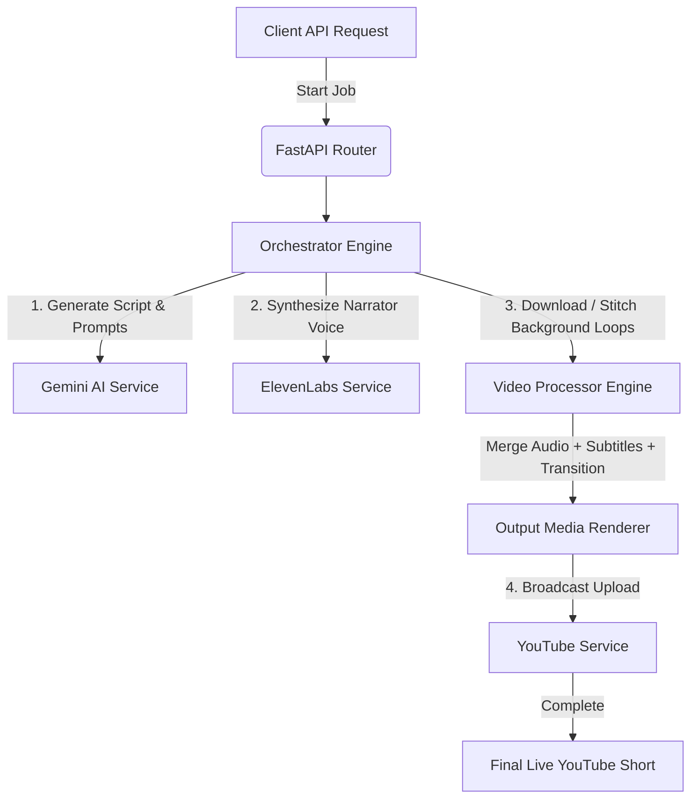

# 🎥 GoudShorts AI

GoudShorts AI is an automated, AI-driven short-form video generation and publishing pipeline. Built on top of **FastAPI**, it leverages **Google Gemini** for script generation, **ElevenLabs** for ultra-realistic voice synthesis, **MoviePy** for hardware-accelerated media rendering, and **Google API Client** for automated publishing to platforms like YouTube.

---

## 🚀 Features

- **AI Scripting & Prompting**: Automatically generate engaging video scripts and asset prompts using the Google Gemini model.
- **Realistic Voiceovers**: Generate high-fidelity narration in multiple voices and languages using ElevenLabs.
- **Automated Video Processing**:
  - Dynamically stitch background loops and raw media assets.
  - Overlay captions/subtitles synced with generated voiceovers.
  - Apply automated audio ducking and video transition effects.
- **YouTube Publishing Pipeline**: Direct, automated broadcast upload workflow via official Google OAuth APIs.
- **Scalable Architecture**: Clean modular design separating controllers, dynamic api routes, schemas, third-party integrations, and media compute engines.

---

## 📂 Project Directory Structure

```text
GoudShorts_AI/
├── .env                  # Configuration variables & API keys (Docker/Server secrets)
├── .gitignore            # Git exclusion rules for logs, cached files, and raw media
├── requirements.txt      # Python library dependencies with pinned versions
├── main.py               # FastAPI server startup and core configuration
│
├── logs/                 # Directory for local real-time execution tracking logs
│   └── YYYY-MM-DD.log
│
├── data/                 # Temporary local media storage (or mounted S3 bucket)
│   ├── audio/            # Generated raw voiceovers (.mp3)
│   ├── video/            # Base raw assets / background loops (.mp4)
│   └── output/           # Rendered production-ready short videos (.mp4)
│
└── src/
    ├── __init__.py
    ├── orchestrator.py   # Central workflow engine controlling script -> audio -> render -> publish
    │
    ├── api/              # FastAPI dynamic endpoints layer
    │   ├── __init__.py
    │   ├── routes.py     # Endpoint routing & URL mapping
    │   └── schemas.py    # Request / Response validation logic using Pydantic
    │
    ├── services/         # Third-party integrations
    │   ├── __init__.py
    │   ├── gemini.py     # AI core scripting service
    │   ├── elevenlabs.py # Speech processing & narration module
    │   └── youtube.py    # Broadcast and video upload pipeline
    │
    └── processors/       # Media computing blocks
        ├── __init__.py
        └── video_engine.py # Hardware encoding, timeline composition, and rendering wrapper
```

---

## ⚙️ Architecture & Workflow



---

## 🛠️ Installation & Setup

### 1. Prerequisites
- **Python 3.10+**
- **FFmpeg** installed on your host system (required for `MoviePy` video rendering).
  - *Ubuntu/Debian:* `sudo apt update && sudo apt install ffmpeg`
  - *macOS:* `brew install ffmpeg`
  - *Windows:* Download build and add to System PATH.

### 2. Clone and Setup Environment
```bash
# Clone the repository
git clone https://github.com/your-username/GoudShorts_AI.git
cd GoudShorts_AI

# Create a virtual environment
python3 -m venv .venv
source .venv/bin/activate  # On Windows use: .venv\Scripts\activate

# Install dependencies
pip install --upgrade pip
pip install -r requirements.txt
```

### 3. Environment Variables Configuration
Create a `.env` file in the root directory:
```env
GEMINI_API_KEY="your_gemini_api_key_here"
ELEVENLABS_API_KEY="your_elevenlabs_api_key_here"
PEXELS_API_KEY="your_pexels_api_key_here"
# Include your Google / YouTube client configuration details here
```

### 4. Running the Server
Start the development server using Uvicorn:
```bash
uvicorn main:app --reload
```
Once running, check out the interactive documentation:
- **Swagger UI**: [http://127.0.0.1:8000/docs](http://127.0.0.1:8000/docs)
- **ReDoc**: [http://127.0.0.1:8000/redoc](http://127.0.0.1:8000/redoc)

---

## 🧑‍💻 Development Guideline

1. **Adding API Endpoints**: Keep routing definitions inside `src/api/routes.py` and response/request formats in `src/api/schemas.py`.
2. **Modifying Media Processors**: Adjust video filters, text font styles, and rendering configurations inside `src/processors/video_engine.py`.
3. **Integrating New Services**: Place all API client wrappers under `src/services/`.

---

## 📄 License
This project is licensed under the MIT License - see the [LICENSE](LICENSE) file for details.