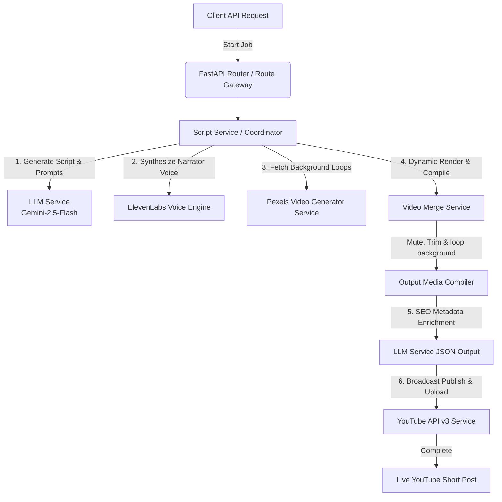

# GoudShorts AI — Enterprise YouTube Shorts Automation Backend Engine 🚀

GoudShorts AI is a production-ready, asynchronous, object-oriented YouTube Shorts generation and distribution platform. Designed with modularity, scalability, and error-resilience, this platform automates the entire content creation lifecycle—converting a text topic into a fully formatted, looped, sound-isolated, and SEO-optimized vertical video posted directly to YouTube.

---

## ⚙️ Architecture & Workflow



---

## 📂 Complete Project Directory Structure

```text
GoudShorts_AI/
├── .env                  # Environment secrets (DO NOT COMMIT)
├── .env-example          # Environment variables template
├── .gitignore            # Excludes temporary cache, binaries, and local tokens from Git
├── alembic.ini           # Alembic database migration config file
├── requirements.txt      # Production-locked Python dependencies
├── main.py               # FastAPI gateway server and Uvicorn entrypoint
│
├── alembic/              # Database migration version files
│   └── versions/         # Python migration scripts for tables
│
├── logs/                 # Active, persistent logging directories
│   └── app_YYYY-MM-DD.log # Dynamic date-bound log files (Restart resilient, no overwrite)
│
├── data/                 # Segmented localized cache directories
│   ├── audio/            # Processed speech-synthesis MP3 files
│   ├── video/            # Raw downloaded vertical stock video MP4 templates
│   └── output/           # Completely compiled final shorts ready for broadcast
│
├── secret/               # Google API Client secret and token folder
│   ├── client_secret.json # OAuth Client JSON secrets
│   └── token.pickle      # Generated OAuth access/refresh token pickle
│
└── src/
    ├── __init__.py
    ├── orchestrator.py   # Orchestration Engine Coordinator
    │
    ├── api/              # HTTP Routing & Handlers
    │   ├── __init__.py
    │   ├── routes.py     # FastAPI core workflow endpoints
    │   └── logs.py       # Developer real-time log access endpoints
    │
    ├── db/               # Database engine session and dependencies
    │   ├── __init__.py
    │   ├── base.py       # SQLAlchemy declarative base
    │   ├── dependencies.py # FastAPI DB dependency injection
    │   └── session.py    # Database connection configuration
    │
    ├── enums/            # State machine state enums
    │   ├── content.py    # ContentStatus enum (DRAFT, AUDIO_GENERATED, etc.)
    │   └── short_video.py # ShortVideoStatus enum (NOT_STARTED, PUBLISHED, etc.)
    │
    ├── schemas/          # Strict Pydantic model payload validations
    │   ├── __init__.py
    │   └── schema.py     # GenerateScriptSchema definition
    │
    ├── sql/              # Database Operations Layer
    │   ├── cruds/        # CRUD operations helpers (content, short_video)
    │   └── models/       # SQLAlchemy models mapping schema (contents, short_videos)
    │
    └── services/         # Third-party platform API wrappers
        ├── __init__.py
        ├── base.py       # Base service abstraction layer
        ├── llm.py        # Gemini AI text script and metadata generator
        ├── sript.py      # Main ScriptService coordinating script-to-publish steps
        ├── elevenlabs.py # ElevenLabs Voice synthesis integration
        ├── video_generator.py # Pexels video fetcher and downloader
        ├── video_merge.py # MoviePy compiler (combines audio, mutes/loops video)
        └── youtube/      # YouTube OAuth authentication & upload wrapper
            └── youtube.py
```

---

## 🛠️ Step 1: Copy & Paste Core Environment Configs

### 1. Requirements File (`requirements.txt`)

Ensure your dependencies are locked down in `requirements.txt`:

```text
fastapi[standard]==0.136.3
uvicorn==0.49.0
alembic==1.18.4
psycopg2-binary==2.9.12
google-generativeai
elevenlabs
moviepy
requests
google-api-python-client
google-auth-oauthlib
google-auth-httplib2
```

Run this command in your terminal to install everything:

```bash
pip install -r requirements.txt
```

### 2. Environment Configuration (`.env`)

Create a file named `.env` in the root folder and set your credentials:

```env
# DB Configuration
DB_CONNECTION='postgresql+psycopg2'
DB_HOST='localhost'
DB_PORT='5432'
DB_USER='postgres'
DB_PASSWORD='your_secure_db_password'
DB_NAME='dgshortai'

# Google Client Credentials paths (Notice spelling defined in code)
GOOGLE_CLINT_SECRET="secret/client_secret.json"
GOOGLE_TOKEN_PICKEL="secret/token.pickle"

# AI Services API Keys
GEMINI_API_KEY="AIzaSyAxxxxxxxxxxxxxxxxxxxxxxxxxxxxxxx"
ELEVENLABS_API_KEY="el_sk_xxxxxxxxxxxxxxxxxxxxxxxxxxxx"
PEXELS_API_KEY="5634b2457xxxxxxxxxxxxxxxxxxxxxxxxxxxxx"
```

---

## 💾 Step 2: Database Migrations Setup

Configure your PostgreSQL database. Run migration scripts using Alembic to initialize tables:

```bash
alembic upgrade head
```

---

## 🤖 Step 3: Google Gemini (Script & Metadata Engine) Setup

Our `LLMService` utilizes Gemini (`gemini-2.5-flash` model) for script generation and SEO metadata extraction.

1. Open [Google AI Studio](https://aistudio.google.com/).
2. Click **Get API Key** and copy the token into the `GEMINI_API_KEY` field in your `.env`.

---

## 🎙️ Step 4: ElevenLabs (Voice Synthesis) Setup

ElevenLabs provides high-quality voice synthesis for storytelling.

1. Log into your dashboard at [ElevenLabs.io](https://elevenlabs.io/).
2. Go to your Profile settings on the bottom left ➔ select **Profile + API Keys**.
3. Copy your API Key and paste it into the `ELEVENLABS_API_KEY` field in your `.env`.
4. The default voice id used is `JBFqnCBsd6RMkjVDRZzb` (can be overridden).

---

## 📷 Step 5: Pexels API (Background Footage) Setup

Pexels offers portrait stock videos under copyright-free CC0 licenses.

1. Sign up for a free developer account at [Pexels.com](https://www.pexels.com/).
2. Request a free API key instantly from their **API Section**.
3. Copy and save it under `PEXELS_API_KEY` in your `.env`.

---

## 📺 Step 6: YouTube API v3 Credentials Setup (OAuth Handshake)

To upload videos without manual intervention, Google requires desktop OAuth verification.

### A. Google Cloud Console Configuration
1. Log into [Google Cloud Console](https://console.cloud.google.com/) using the Gmail account tied to your YouTube channel.
2. Select **New Project** from the top dropdown. Name it `GoudShorts AI`.
3. In the sidebar, select **APIs & Services** ➔ **Library**. Search for **YouTube Data API v3** and click **Enable**.
4. In the sidebar, click **Google Auth Platform** (formerly *OAuth Consent Screen*):
   * Set **App Name** to `Shorts Bot Engine`.
   * Under **Test Users**, click **Add Users** and add your own YouTube Channel Gmail ID (Highly Critical: Non-test users will face authentication block codes).
5. In the sidebar, click **Credentials**:
   * Click **+ CREATE CREDENTIALS** ➔ **OAuth Client ID**.
   * Set **Application Type** to `Desktop app`. Click **Create**.
   * Download the generated client secrets JSON file.

### B. Project File Association
1. Create a folder named `secret` in the root of the project: `mkdir secret`.
2. Move and rename the downloaded file to exactly `secret/client_secret.json`.

### C. First-Time Interactive Handshake
1. Run your FastAPI development server.
2. Trigger the upload endpoint or trigger a run. A browser tab will pop up, asking you to sign into Google.
3. Choose your YouTube Gmail account ➔ Click **Advanced** ➔ Go to **Shorts Bot Engine (unsafe)**.
4. Check the box granting permissions to manage your YouTube account and click **Allow**.
5. Once complete, your server will automatically generate a token file at the path designated by `GOOGLE_TOKEN_PICKEL` (defaults to `secret/token.pickle`).

> [!NOTE]
> For future cloud deployments (VPS, EC2), simply copy this generated `token.pickle` alongside your files. The browser handshake will never be needed again!

---

## 🚀 Running the Application

### 1. Launching the API Engine (FastAPI)

Run the server using Uvicorn:

```bash
python -m uvicorn main:app --host 0.0.0.0 --port 8000 --reload
```

Open [http://localhost:8000/docs](http://localhost:8000/docs) in your browser to access the dynamic interactive Swagger API console.

### 2. Available Endpoints

| Method | Endpoint | Description | Payload / Params |
| :--- | :--- | :--- | :--- |
| **POST** | `/api/v1/generate-script` | Generates a 50-word script about a topic. | `{"topic": "string"}` |
| **POST** | `/api/v1/text/{content_id}/generate-audio` | Converts script to MP3 voiceover. | - |
| **POST** | `/api/v1/text/{content_id}/get-video` | Fetches vertical video background from Pexels. | - |
| **POST** | `/api/v1/content/{content_id}/merge-video` | Stitches voiceover audio onto muted background loop. | - |
| **POST** | `/api/v1/video/{content_id}/metadata` | Generates title, description, and hashtags using LLM. | - |
| **POST** | `/api/v1/video/{video_id}/publish` | Broadcast uploads short video to YouTube. | - |
| **GET** | `/logs/current` | Fetches the last 500 lines of today's live execution log. | - |
| **GET** | `/logs/filter` | Fetches historical log file archives. | `?date=YYYY-MM-DD` |

### 3. Fetching Logs

To check live operation histories or archival records:

```bash
# Fetching current live logs
curl -X GET "http://localhost:8000/logs/current"
```

### 4. Setting Up Daily Automation (Production Cron Jobs)

To schedule a post every day at exactly 6:00 PM:

```bash
crontab -e
```

Add this cron configuration at the bottom of the system sheet:

```text
0 18 * * * curl -X POST "http://localhost:8000/api/v1/generate-short?topic=Ancient%20Mysteries" >> /absolute/path/to/GoudShorts_AI/logs/cron.log 2>&1
```

---

Created with ❤️ by **Dilip Goud**. Happy Automating!