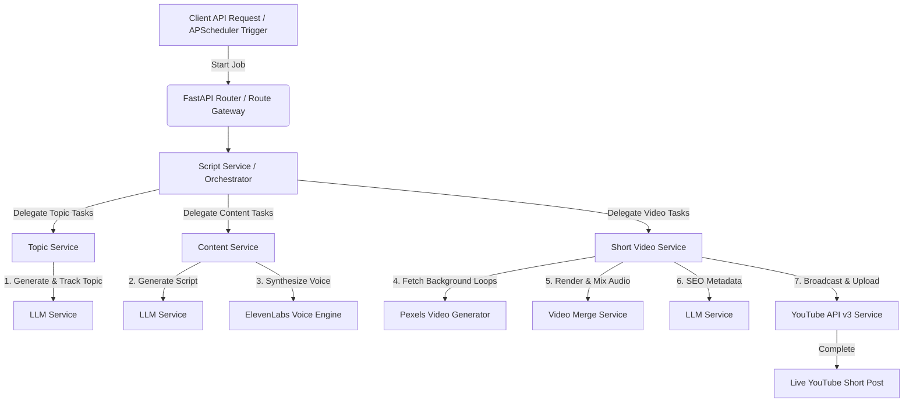
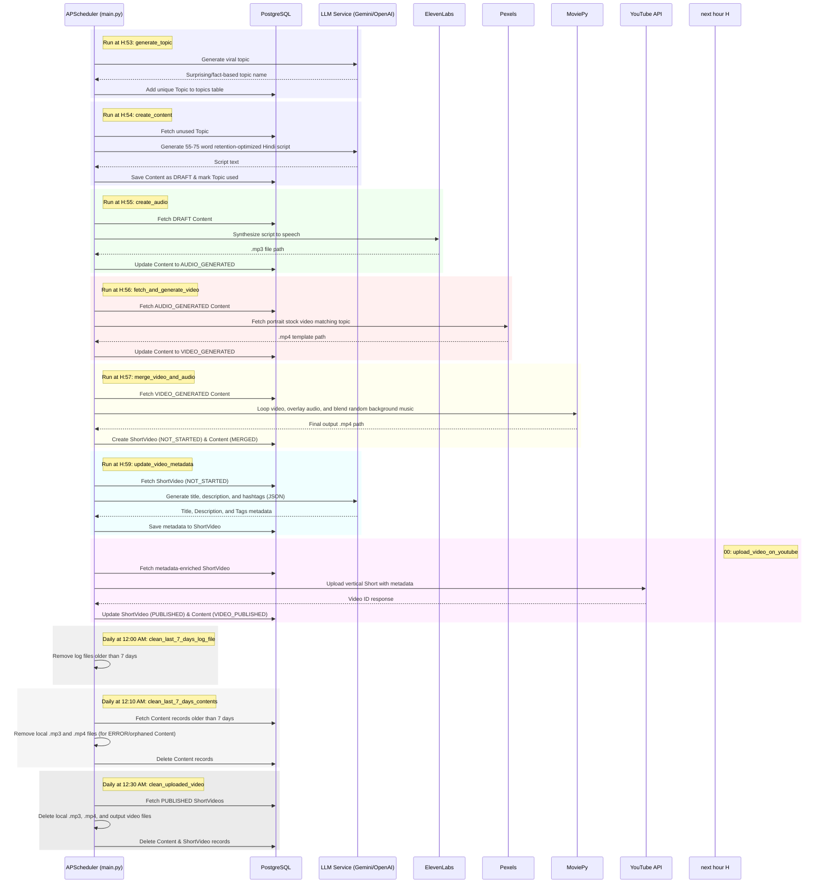

# YouTube Shorts Auto-Creator (DGShorts AI)

DGShorts AI is a tool that automatically creates and uploads YouTube Shorts. You give it a topic (or let it choose one), and it automatically:

1. **Generates a script** in simple Hindi using AI (Gemini or OpenAI).
2. **Converts the script to voice** narration using ElevenLabs.
3. **Finds matching background videos** on Pexels.
4. **Stitches them together** into a final vertical video (YouTube Short).
5. **Generates SEO metadata** (Title, Description, Tags) using AI.
6. **Uploads the video** directly to your YouTube channel.

You can trigger this manually using the API or let it run automatically in the background on a daily schedule.

---

## ⚙️ Architecture & Core Workflow

The system is designed with a decoupled architecture, where responsibilities are split across domain-specific services (`TopicService`, `ContentService`, `ShortVideoService`) managed by a central `ScriptService` orchestrator. The background orchestrator stages the creation of each video step-by-step to handle rate limits, API failures, and resource usage efficiently.

### System Components Flow



### Micro-Service Domains

To maintain clean code boundaries, logic is separated into specific domain services:
* **`ScriptService`**: Acts as the central orchestrator and scheduler wrapper. It controls the step-by-step workflow timing and delegates tasks to domain services.
* **`TopicService`**: Dedicated strictly to generating, validating, and managing the lifecycle of viral topics in the database.
* **`ContentService`**: Handles generating retention-optimized Hindi scripts from topics, and triggers the text-to-speech audio synthesis.
* **`ShortVideoService`**: Manages the video pipeline, including fetching background footage, triggering the render compilation, generating SEO metadata, and publishing to YouTube.

---

## 💾 Database Schema

The persistence layer uses a PostgreSQL database managed via SQLAlchemy and Alembic. Below is the schema layout mapping the content creation state:

### 1. `topics` Table
This table stores generated topics to track usage history and avoid repetitive content.
* **`id`** (`Integer`, Primary Key, Index): Unique ID of the topic.
* **`name`** (`String(255)`, Not Null, Unique): The generated topic name or category.
* **`slug`** (`String(255)`, Not Null, Unique): URL-friendly slug representing the topic.
* **`used_count`** (`Integer`, Not Null, Default: `0`): The number of times this topic has been used.
* **`last_used_at`** (`DateTime`, Nullable): The last time this topic was picked for content generation.
* **`created_at`** / **`updated_at`** (`DateTime`): Operational audit timestamps.

### 2. `contents` Table
This table stores the text transcripts and intermediate media paths.
* **`id`** (`Integer`, Primary Key, Index): Unique ID of the content job.
* **`title`** (`String(255)`, Not Null): Generated topic name (referenced from `topics.name`).
* **`content`** (`Text`, Not Null): Synthesized narration script (typically Hindi).
* **`voice_id`** (`String(255)`, Nullable, Default: `JBFqnCBsd6RMkjVDRZzb`): ElevenLabs voice identifier.
* **`status`** (`Enum(ContentStatus)`, Default: `DRAFT`): Current workflow state.
* **`audio_path`** (`String(255)`, Nullable): Path to the generated speech MP3 file.
* **`video_path`** (`String(255)`, Nullable): Path to the downloaded Pexels stock video.
* **`created_at`** / **`updated_at`** (`DateTime`): Operational audit timestamps.

### 3. `short_videos` Table
This table maps compiled video artifacts and their publication metadata.
* **`id`** (`Integer`, Primary Key, Index): Unique ID of the short video record.
* **`content_id`** (`Integer`, ForeignKey `contents.id`, Not Null): Associated script reference.
* **`title`** (`String`): Catchy, click-worthy metadata title.
* **`description`** (`Text`): SEO-optimized YouTube description.
* **`tags`** (`String`): Comma-separated search tags.
* **`output_path`** (`String`): Local path to the final rendered video MP4.
* **`youtube_video_path`** (`String`, Nullable): Direct URL to the live YouTube video.
* **`status`** (`Enum(ShortVideoStatus)`, Default: `NOT_STARTED`): Upload staging status.
* **`created_at`** / **`updated_at`** (`DateTime`): Operational audit timestamps.
* **`published_at`** (`DateTime`, Nullable): Actual YouTube publication timestamp.

### 3. Workflow State Enums

* **`ContentStatus`**:
  * `draft`: Initial script generated.
  * `audio_generated`: Text-to-speech audio synthesized successfully.
  * `video_generated`: Background video sourced and downloaded.
  * `merged`: Audio track overlaid onto the stock video and rendered.
  * `video_published`: Video upload finalized and live on YouTube.
  * `error`: Internal pipeline failure.

* **`ShortVideoStatus`**:
  * `not_started`: Initial state upon render compilation.
  * `processing`: Upload in progress.
  * `completed`: Video loaded to YouTube servers.
  * `published`: Video actively set to public.
  * `failed`: YouTube upload aborted.

---

## 📂 Complete Project Directory Structure

```text
dg_shorts_ai/
├── .env                  # Environment secrets (DO NOT COMMIT)
├── .env-example          # Environment variables template
├── .gitignore            # Excludes temporary cache, binaries, and local tokens from Git
├── alembic.ini           # Alembic database migration config file
├── requirements.txt      # Production-locked Python dependencies
├── main.py               # FastAPI gateway server and Uvicorn entrypoint (configures APScheduler background tasks)
│
├── alembic/              # Database migration version files
│   └── versions/         # Python migration scripts for tables
│
├── config/               # Application configurations and API secrets
│   ├── app/              # Config module/helpers
│   └── secret/           # Google API Client secret and token folder
│       ├── client_secret.json # OAuth Client JSON secrets
│       └── token.pickle  # Generated OAuth access/refresh token pickle
│
├── logs/                 # Active, persistent logging directories
│   └── app_YYYY-MM-DD.log # Dynamic date-bound log files (Restart resilient, no overwrite)
│
├── data/                 # Segmented localized cache directories
│   ├── audio/            # Processed speech-synthesis MP3 files
│   ├── video/            # Raw downloaded vertical stock video MP4 templates
│   └── output/           # Completely compiled final shorts ready for broadcast
│
├── utils/                # Utility modules
│   └── logger.py         # Central logging engine configuration
│
└── src/
    ├── __init__.py
    │
    ├── api/              # HTTP Routing & Handlers
    │   ├── __init__.py
    │   └── v1/           # Version 1 API Routes
    │       ├── content.py # Script & audio generation endpoints
    │       ├── logs.py    # Developer real-time log access endpoints
    │       ├── topic.py   # Topic endpoints
    │       └── video.py   # Video generation, merge, metadata, and publishing endpoints
    │
    ├── db/               # Database engine session and dependencies
    │   ├── __init__.py
    │   ├── base.py       # SQLAlchemy declarative base
    │   ├── dependencies.py # FastAPI DB dependency injection
    │   └── session.py    # Database connection configuration
    │
    ├── enums/            # State machine state enums
    │   ├── content.py    # ContentStatus enum (draft, audio_generated, etc.)
    │   └── short_video.py # ShortVideoStatus enum (not_started, published, etc.)
    │
    ├── integrations/     # Third-party API wrappers
    │   ├── elevenlabs.py       # ElevenLabs Voice synthesis integration
    │   ├── llm.py              # LLM wrapper (Gemini and OpenAI support)
    │   ├── video_generator.py  # Pexels video fetcher and downloader
    │   ├── video_merge.py      # Video compiler wrapper
    │   └── youtube.py          # YouTube OAuth authentication & upload wrapper
    │
    ├── jobs/             # Scheduled APScheduler jobs
    │   └── automation_jobs.py
    │
    ├── schemas/          # Strict Pydantic model payload validations
    │   ├── __init__.py
    │   ├── content.py    # Content schemas
    │   ├── schema.py     # GenerateScriptSchema definition
    │   └── short_video.py # Video schemas
    │
    ├── services/         # Orchestration & automation services
    │   ├── __init__.py
    │   ├── base.py       # Base service abstraction layer
    │   ├── content.py    # Content processing service
    │   ├── script.py     # Main ScriptService coordinating script-to-publish steps
    │   ├── short_video.py # Video logic service
    │   └── topic.py      # Topic logic service
    │
    └── sql/              # Database Operations Layer
        ├── cruds/        # CRUD operations helpers (content, short_video)
        └── models/       # SQLAlchemy models mapping schema (contents, short_videos)
```

---

## 🛠️ Step 1: Copy & Paste Core Environment Configs

### 1. Requirements File (`requirements.txt`)

Ensure your dependencies are locked down in `requirements.txt`:

```text
fastapi[standard]==0.136.3
uvicorn==0.49.0
alembic==1.18.4
psycopg2-binary==2.9.12
openai==2.41.1
sqlalchemy==2.0.50
apscheduler==3.11.2
python-dotenv==1.2.2
google-genai==2.8.0
elevenlabs==2.52.0
moviepy==2.2.1
requests==2.34.2
google-api-python-client==2.197.0
google-auth-oauthlib==1.4.0
google-auth-httplib2==0.4.0
pymysql==1.2.0
```

Run this command in your terminal to install everything:

```bash
pip install -r requirements.txt
```

### 2. Environment Configuration (`.env`)

Create a file named `.env` in the root folder and set your credentials:

```env
# DB Configuration
DB_CONNECTION='postgresql+psycopg2'
DB_HOST='localhost'
DB_PORT='5432'
DB_USER='postgres'
DB_PASSWORD='your_secure_db_password'
DB_NAME='dgshortai'

# AI Provider Configuration (Choose 'gemini' or 'openai')
AI_PROVIDER_NAME='gemini'
AI_MODEL_NAME='gemini-2.5-flash'
AI_API_KEY='your_api_key_here'

# ElevenLabs Speech Synthesis API Key
ELEVENLABS_API_KEY='your_elevenlabs_api_key_here'
VOICE_ID='JBFqnCBsd6RMkjVDRZzb'

# Pexels API Configurations
PEXELS_API_URL='https://api.pexels.com/videos/search'
PEXELS_API_KEY='your_pexels_api_key_here'

# Google Client Credentials paths
GOOGLE_CLIENT_SECRET='config/secret/client_secret.json'
GOOGLE_TOKEN_PICKLE='config/secret/token.pickle'
YOUTUBE_SCOPES='https://www.googleapis.com/auth/youtube.upload'

# Directory Settings (Mandatory, no defaults)
AUDIO_DIRECTORY='data/audio'
VIDEO_DIRECTORY='data/video'
VIDEO_OUTPUT_DIRECTORY='data/output'
MUSIC_DIRECTORY='data/music'
```

---

## 💾 Step 2: Database Migrations Setup

Configure your PostgreSQL database. Run migration scripts using Alembic to initialize tables:

```bash
alembic upgrade head
```

---

## 🤖 Step 3: LLM Integration (Gemini & OpenAI) Setup

The `LLMService` wrapper supports both the modern Google GenAI SDK (`google-genai` package) with the `gemini-2.5-flash` model and the OpenAI SDK (`openai` package) with standard models.

1. **For Gemini:** Set `AI_PROVIDER_NAME=gemini` and your `AI_API_KEY` obtained from [Google AI Studio](https://aistudio.google.com/).
2. **For OpenAI:** Set `AI_PROVIDER_NAME=openai`, choose an `AI_MODEL_NAME` (e.g. `gpt-3.5-turbo` or `gpt-4o-mini`), and set your OpenAI `AI_API_KEY`.

---

## 🎙️ Step 4: ElevenLabs (Voice Synthesis) Setup

ElevenLabs provides high-quality voice synthesis for storytelling.

1. Log into your dashboard at [ElevenLabs.io](https://elevenlabs.io/).
2. Go to your Profile settings on the bottom left ➔ select **Profile + API Keys**.
3. Copy your API Key and paste it into the `ELEVENLABS_API_KEY` field in your `.env`.
4. Configure the optional `VOICE_ID` in `.env` if desired (the system defaults to `"JBFqnCBsd6RMkjVDRZzb"`).

---

## 📷 Step 5: Pexels API (Background Footage) Setup

Pexels offers portrait stock videos under copyright-free CC0 licenses.

1. Sign up for a free developer account at [Pexels.com](https://www.pexels.com/).
2. Request a free API key instantly from their **API Section**.
3. Copy and save it under `PEXELS_API_KEY` in your `.env`.

---

## 🎙️ Step 6: Background Music Library Setup

The engine automatically selects, loops, and mixes background music tracks into the final render clip.
1. Create a folder named `music` inside `data` (or the folder configured as your `MUSIC_DIRECTORY`): `mkdir -p data/music`.
2. Place your copyright-free background music tracks (e.g. `.mp3` or `.wav` format) in this folder.
3. The video merging compiler will randomly pick one of these tracks during compilation, loop it to match the narration duration, reduce its volume by default to `12%` (`0.12`), and apply a 1-second fade-in and 2-second fade-out.

---

## 📺 Step 7: YouTube API v3 Credentials Setup (OAuth Handshake)

To upload videos without manual intervention, Google requires desktop OAuth verification.

### A. Google Cloud Console Configuration
1. Log into [Google Cloud Console](https://console.cloud.google.com/) using the Gmail account tied to your YouTube channel.
2. Select **New Project** from the top dropdown. Name it `DGShorts AI`.
3. In the sidebar, select **APIs & Services** ➔ **Library**. Search for **YouTube Data API v3** and click **Enable**.
4. In the sidebar, click **Google Auth Platform** (formerly *OAuth Consent Screen*):
   * Set **App Name** to `Shorts Bot Engine`.
   * Under **Test Users**, click **Add Users** and add your own YouTube Channel Gmail ID (Highly Critical: Non-test users will face authentication block codes).
5. In the sidebar, click **Credentials**:
   * Click **+ CREATE CREDENTIALS** ➔ **OAuth Client ID**.
   * Set **Application Type** to `Desktop app`. Click **Create**.
   * Download the generated client secrets JSON file.

### B. Project File Association
1. Create a folder named `secret` inside `config`: `mkdir -p config/secret`.
2. Move and rename the downloaded file to exactly `config/secret/client_secret.json`.

### C. First-Time Interactive Handshake
1. Run your FastAPI development server.
2. Trigger the upload endpoint or trigger a run. A browser tab will pop up, asking you to sign into Google.
3. Choose your YouTube Gmail account ➔ Click **Advanced** ➔ Go to **Shorts Bot Engine (unsafe)**.
4. Check the box granting permissions to manage your YouTube account and click **Allow**.
5. Once complete, your server will automatically generate a token file at the path designated by `GOOGLE_TOKEN_PICKLE` (defaults to `config/secret/token.pickle`).

> [!NOTE]
> For future cloud deployments (VPS, EC2), simply copy this generated `token.pickle` alongside your files. The browser handshake will never be needed again!

---

## 🚀 Running the Application

### 1. Launching the API Engine (FastAPI)

Run the server using Uvicorn:

```bash
python -m uvicorn main:app --host 0.0.0.0 --port 8000 --reload
```

Open [http://localhost:8000/docs](http://localhost:8000/docs) in your browser to access the dynamic interactive Swagger API console.

### 2. Available Endpoints

| Method | Endpoint | Description | Payload / Params |
| :--- | :--- | :--- | :--- |
| **GET** | `/api/v1/health` | Health check endpoint | - |
| **POST** | `/api/v1/topic/` | Generates a viral topic via LLM Service and stores/tracks it in the database. | `{"name": "category/seed"}` |
| **GET** | `/api/v1/topic/{id}` | Gets a topic by ID. | `id` (path parameter) |
| **GET** | `/api/v1/topic/random` | Gets a random unused topic. | - |
| **POST** | `/api/v1/content/generate` | Generates a Hindi script about a stored topic ID and creates a draft Content record. | `{"topic_id": int}` |
| **GET** | `/api/v1/content/{id}` | Gets a content record by ID. | `id` (path parameter) |
| **POST** | `/api/v1/content/{id}/generate-audio` | Converts script text to speech audio via ElevenLabs. | `id` (path parameter) |
| **POST** | `/api/v1/video/content/{content_id}/background` | Fetches vertical matching background video from Pexels. | `content_id` (path parameter) |
| **POST** | `/api/v1/video/video/{video_id}/merge` | Merges narration audio, downloads vertical background video, mixes background music, and creates a ShortVideo. | `video_id` (path parameter) |
| **POST** | `/api/v1/video/video/{video_id}/metadata` | Generates Title, Description, and Tags via LLM. | `video_id` (path parameter) |
| **POST** | `/api/v1/video/video/{video_id}/publish` | Direct-uploads the compiled video onto YouTube via API. | `video_id` (path parameter) |
| **GET** | `/api/v1/video/list` | Gets a list of all short video records. | query params (status, etc.) |
| **GET** | `/api/v1/logs/current` | Fetches the last 500 lines of today's live execution log. | - |
| **GET** | `/api/v1/logs/filter` | Fetches historical log file archives. | `?date=YYYY-MM-DD` (query parameter) |
| **GET** | `/api/v1/jobs` | Gets status and timing details of scheduled background jobs. | - |

---

## 📅 Background Orchestrator & Task Scheduling

The FastAPI backend runs `APScheduler` (configured with a persistent `SQLAlchemyJobStore` to survive restarts) in `main.py` to drive a decoupled, step-by-step queue pipeline. This prevents database and network blockages while safely distributing intensive media tasks.

The pipeline runs 4 times a day (at hours **7:00 AM, 12:00 PM, 5:00 PM, and 7:00 PM** local server time) with a staggered step-by-step delay sequence to ensure tasks execute in logical order.

### Queue Execution Lifecycle



### Scheduled Jobs Reference

* **Topic Auto-Generation (`generate_topic`):** Runs at **7:53 AM, 12:53 PM, 5:53 PM, and 7:53 PM** daily. Invokes the LLM to yield a fact-based viral niche topic and tracks it in the `topics` table.
* **Script Content Generation (`create_content`):** Runs at **7:54 AM, 12:54 PM, 5:54 PM, and 7:54 PM** daily. Automatically selects an unused topic from the database, prompts the LLM to generate a suspenseful Hindi narration script, and inserts a `DRAFT` status content record.
* **Speech Synthesis (`create_audio`):** Runs at **7:55 AM, 12:55 PM, 5:55 PM, and 7:55 PM** daily. Pulls pending `DRAFT` content records and invokes ElevenLabs text-to-speech to save the voice narration audio locally under `data/audio/` (transitions state to `AUDIO_GENERATED`).
* **Background Video Sourcing (`fetch_and_generate_video`):** Runs at **7:56 AM, 12:56 PM, 5:56 PM, and 7:56 PM** daily. Identifies content with generated audio, searches Pexels for matching portrait stock videos, downloads the file to `data/video/`, and shifts state to `VIDEO_GENERATED`.
* **Video Compilation, Loop & Audio Blend (`merge_video_and_audio`):** Runs at **7:57 AM, 12:57 PM, 5:57 PM, and 7:57 PM** daily. Uses `MoviePy` to loop/clip the stock video to match the audio narration duration, overlay the voice track composite-mixed with a random background music file from `MUSIC_DIRECTORY` (volume set to `0.12` with fade-in/fade-out), write the completed MP4 to `data/output/`, and instantiate a new `ShortVideo` database entry in status `NOT_STARTED` (shifting Content status to `MERGED`).
* **Metadata Enrichment (`update_video_metadata`):** Runs at **7:59 AM, 12:59 PM, 5:59 PM, and 7:59 PM** daily. Fetches `NOT_STARTED` short videos and prompts the LLM to generate click-worthy Titles, Descriptions, and Hashtag lists.
* **YouTube Upload & Publish (`upload_video_on_youtube`):** Runs at **8:00 AM, 1:00 PM, 6:00 PM, and 8:00 PM** daily. Directly uploads the fully metadata-configured vertical shorts video onto YouTube.
* **Content Record Retention (`clean_last_7_days_contents`):** Runs once daily at **12:10 AM**. Identifies database Content records older than 7 days that either failed (status `ERROR`) or were never published to YouTube, deletes their local speech and stock video files, and purges the Content records from the database.
* **Local Workspace Cleanup (`clean_uploaded_video`):** Runs once daily at **12:30 AM**. Purges uploaded local files (`audio/`, `video/`, and final `output/`) and deletes Content & ShortVideo records for published videos from the database.
* **Log Rotation (`clean_last_7_days_log_file`):** Runs once daily at **12:00 AM** (midnight) to clean archival log files in the `logs/` directory older than 7 days.

---

Created with ❤️ by **Dilip Goud**. Happy Automating!

### [⬆ back to top](#youtube-shorts-auto-creator-dgshorts-ai)