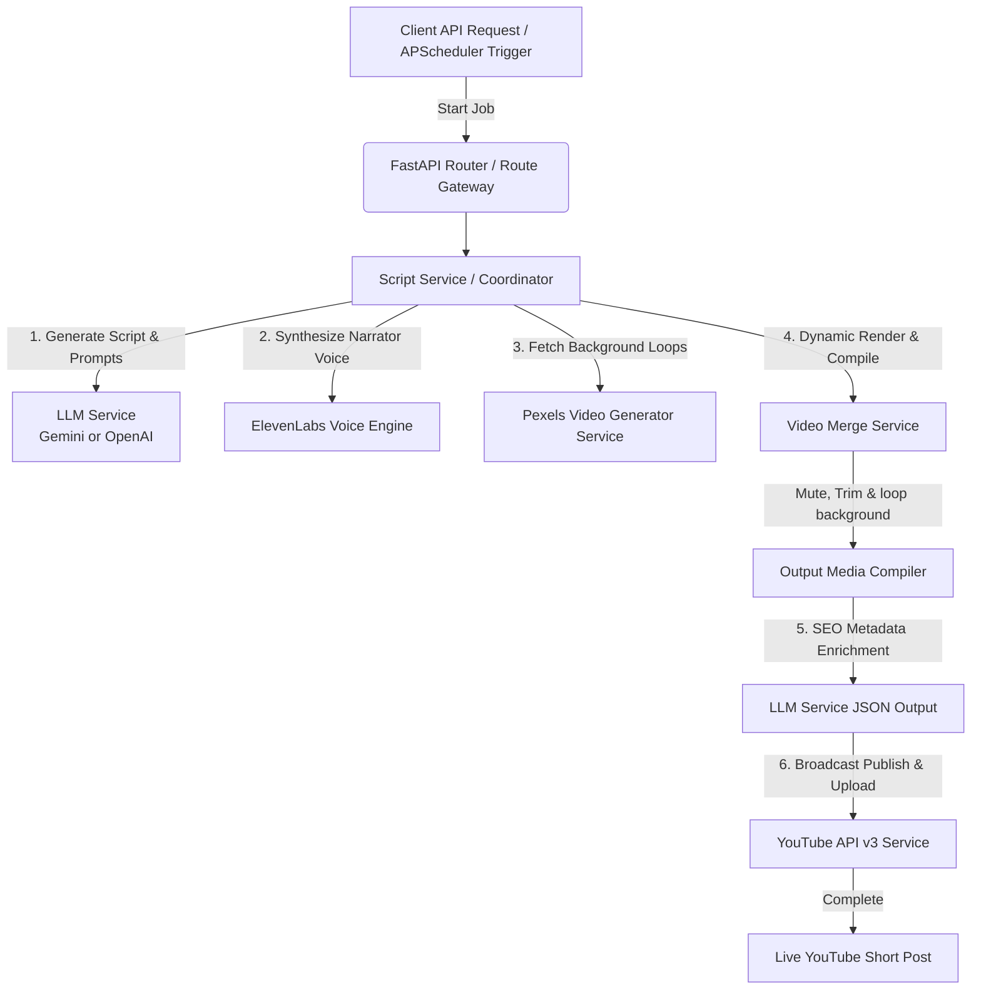
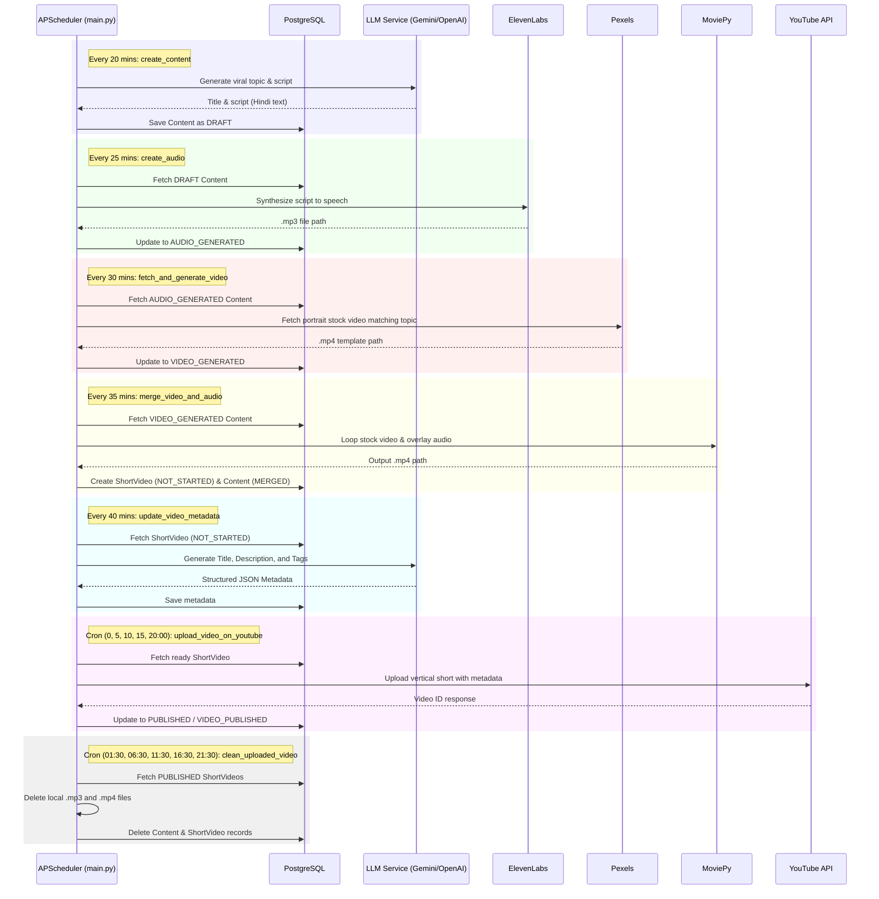

# GoudShorts AI — Enterprise YouTube Shorts Automation Backend Engine 🚀

GoudShorts AI is a production-ready, asynchronous, object-oriented YouTube Shorts generation and distribution platform. Designed with modularity, scalability, and error-resilience, this platform automates the entire content creation lifecycle—converting dynamic topics into fully formatted, looped, sound-isolated, and SEO-optimized vertical videos posted directly to YouTube.

---

## ⚙️ Architecture & Core Workflow

The system is designed with a decoupled architecture. The background orchestrator stages the creation of each video step-by-step to handle rate limits, API failures, and resource usage efficiently.

### System Components Flow



---

## 💾 Database Schema

The persistence layer uses a PostgreSQL database managed via SQLAlchemy and Alembic. Below is the schema layout mapping the content creation state:

### 1. `contents` Table
This table stores the text transcripts and intermediate media paths.
* **`id`** (`Integer`, Primary Key, Index): Unique ID of the content job.
* **`title`** (`String(255)`, Not Null): Generated topic or user-provided seed.
* **`content`** (`Text`, Not Null): Synthesized narration script (typically Hindi).
* **`voice_id`** (`String(255)`, Nullable, Default: `JBFqnCBsd6RMkjVDRZzb`): ElevenLabs voice identifier.
* **`status`** (`Enum(ContentStatus)`, Default: `DRAFT`): Current workflow state.
* **`audio_path`** (`String(255)`, Nullable): Path to the generated speech MP3 file.
* **`video_path`** (`String(255)`, Nullable): Path to the downloaded Pexels stock video.
* **`created_at`** / **`updated_at`** (`DateTime`): Operational audit timestamps.

### 2. `short_videos` Table
This table maps compiled video artifacts and their publication metadata.
* **`id`** (`Integer`, Primary Key, Index): Unique ID of the short video record.
* **`content_id`** (`Integer`, ForeignKey `contents.id`, Not Null): Associated script reference.
* **`title`** (`String`): Catchy, click-worthy metadata title.
* **`description`** (`Text`): SEO-optimized YouTube description.
* **`tags`** (`String`): Comma-separated search tags.
* **`output_path`** (`String`): Local path to the final rendered video MP4.
* **`youtube_video_path`** (`String`, Nullable): Direct URL to the live YouTube video.
* **`status`** (`Enum(ShortVideoStatus)`, Default: `NOT_STARTED`): Upload staging status.
* **`created_at`** / **`updated_at`** (`DateTime`): Operational audit timestamps.
* **`published_at`** (`DateTime`, Nullable): Actual YouTube publication timestamp.

### 3. Workflow State Enums

* **`ContentStatus`**:
  * `draft`: Initial script generated.
  * `audio_generated`: Text-to-speech audio synthesized successfully.
  * `video_generated`: Background video sourced and downloaded.
  * `merged`: Audio track overlaid onto the stock video and rendered.
  * `video_published`: Video upload finalized and live on YouTube.
  * `error`: Internal pipeline failure.

* **`ShortVideoStatus`**:
  * `not_started`: Initial state upon render compilation.
  * `processing`: Upload in progress.
  * `completed`: Video loaded to YouTube servers.
  * `published`: Video actively set to public.
  * `failed`: YouTube upload aborted.

---

## 📂 Complete Project Directory Structure

```text
GoudShorts_AI/
├── .env                  # Environment secrets (DO NOT COMMIT)
├── .env-example          # Environment variables template
├── .gitignore            # Excludes temporary cache, binaries, and local tokens from Git
├── alembic.ini           # Alembic database migration config file
├── requirements.txt      # Production-locked Python dependencies
├── main.py               # FastAPI gateway server and Uvicorn entrypoint (configures APScheduler background tasks)
│
├── alembic/              # Database migration version files
│   └── versions/         # Python migration scripts for tables
│
├── logs/                 # Active, persistent logging directories
│   └── app_YYYY-MM-DD.log # Dynamic date-bound log files (Restart resilient, no overwrite)
│
├── data/                 # Segmented localized cache directories
│   ├── audio/            # Processed speech-synthesis MP3 files
│   ├── video/            # Raw downloaded vertical stock video MP4 templates
│   └── output/           # Completely compiled final shorts ready for broadcast
│
├── secret/               # Google API Client secret and token folder
│   ├── client_secret.json # OAuth Client JSON secrets
│   └── token.pickle      # Generated OAuth access/refresh token pickle
│
├── utils/                # Utility modules
│   └── logger.py         # Central logging engine configuration
│
└── src/
    ├── __init__.py
    ├── orchestrator.py   # Standing helper orchestrator
    │
    ├── api/              # HTTP Routing & Handlers
    │   ├── __init__.py
    │   ├── routes.py     # FastAPI core workflow endpoints
    │   └── logs.py       # Developer real-time log access endpoints
    │
    ├── db/               # Database engine session and dependencies
    │   ├── __init__.py
    │   ├── base.py       # SQLAlchemy declarative base
    │   ├── dependencies.py # FastAPI DB dependency injection
    │   └── session.py    # Database connection configuration
    │
    ├── enums/            # State machine state enums
    │   ├── content.py    # ContentStatus enum (draft, audio_generated, etc.)
    │   └── short_video.py # ShortVideoStatus enum (not_started, published, etc.)
    │
    ├── schemas/          # Strict Pydantic model payload validations
    │   ├── __init__.py
    │   └── schema.py     # GenerateScriptSchema definition
    │
    ├── sql/              # Database Operations Layer
    │   ├── cruds/        # CRUD operations helpers (content, short_video)
    │   └── models/       # SQLAlchemy models mapping schema (contents, short_videos)
    │
    └── services/         # Orchestration & automation services
        ├── __init__.py
        ├── base.py       # Base service abstraction layer
        ├── script.py     # Main ScriptService coordinating script-to-publish steps
        ├── automation.py # AutomationService running database cleanup and background pipeline automation
        ├── video_merge.py # MoviePy compiler (combines audio, mutes/loops video)
        └── integrations/ # Third-party API wrappers
            ├── elevenlabs.py       # ElevenLabs Voice synthesis integration
            ├── llm.py              # LLM wrapper (Gemini and OpenAI support)
            ├── video_generator.py  # Pexels video fetcher and downloader
            └── youtube.py          # YouTube OAuth authentication & upload wrapper
```

---

## 🛠️ Step 1: Copy & Paste Core Environment Configs

### 1. Requirements File (`requirements.txt`)

Ensure your dependencies are locked down in `requirements.txt`:

```text
fastapi[standard]==0.136.3
uvicorn==0.49.0
alembic==1.18.4
psycopg2-binary==2.9.12
sqlalchemy==2.0.50
apscheduler==3.11.2
python-dotenv==1.2.2
google-genai==2.8.0
openai==2.41.1
elevenlabs==2.52.0
moviepy==2.2.1
requests==2.34.2
google-api-python-client==2.197.0
google-auth-oauthlib==1.4.0
google-auth-httplib2==0.4.0
```

Run this command in your terminal to install everything:

```bash
pip install -r requirements.txt
```

### 2. Environment Configuration (`.env`)

Create a file named `.env` in the root folder and set your credentials:

```env
# DB Configuration
DB_CONNECTION='postgresql+psycopg2'
DB_HOST='localhost'
DB_PORT='5432'
DB_USER='postgres'
DB_PASSWORD='your_secure_db_password'
DB_NAME='dgshortai'

# AI Provider Configuration (Choose 'gemini' or 'openai')
AI_PROVIDER_NAME='gemini'
AI_MODEL_NAME='gemini-2.5-flash'
AI_API_KEY='your_api_key_here'

# ElevenLabs Speech Synthesis API Key
ELEVENLABS_API_KEY='your_elevenlabs_api_key_here'
VOICE_ID='JBFqnCBsd6RMkjVDRZzb'

# Pexels Stock Video API Key
PEXELS_API_KEY='your_pexels_api_key_here'

# Google Client Credentials paths
GOOGLE_CLINT_SECRET='secret/client_secret.json'
GOOGLE_TOKEN_PICKEL='secret/token.pickle'
```

---

## 💾 Step 2: Database Migrations Setup

Configure your PostgreSQL database. Run migration scripts using Alembic to initialize tables:

```bash
alembic upgrade head
```

---

## 🤖 Step 3: LLM Integration (Gemini & OpenAI) Setup

The `LLMService` wrapper supports both the modern Google GenAI SDK (`google-genai` package) with the `gemini-2.5-flash` model and the OpenAI SDK (`openai` package) with `gpt-3.5-turbo` (or other standard models).

1. **For Gemini:** Set `AI_PROVIDER_NAME=gemini` and your `AI_API_KEY` obtained from [Google AI Studio](https://aistudio.google.com/).
2. **For OpenAI:** Set `AI_PROVIDER_NAME=openai`, choose an `AI_MODEL_NAME` (e.g. `gpt-3.5-turbo` or `gpt-4o-mini`), and set your OpenAI `AI_API_KEY`.

---

## 🎙️ Step 4: ElevenLabs (Voice Synthesis) Setup

ElevenLabs provides high-quality voice synthesis for storytelling.

1. Log into your dashboard at [ElevenLabs.io](https://elevenlabs.io/).
2. Go to your Profile settings on the bottom left ➔ select **Profile + API Keys**.
3. Copy your API Key and paste it into the `ELEVENLABS_API_KEY` field in your `.env`.
4. Configure the optional `VOICE_ID` in `.env` if desired (the system defaults to `"JBFqnCBsd6RMkjVDRZzb"`).

---

## 📷 Step 5: Pexels API (Background Footage) Setup

Pexels offers portrait stock videos under copyright-free CC0 licenses.

1. Sign up for a free developer account at [Pexels.com](https://www.pexels.com/).
2. Request a free API key instantly from their **API Section**.
3. Copy and save it under `PEXELS_API_KEY` in your `.env`.

---

## 📺 Step 6: YouTube API v3 Credentials Setup (OAuth Handshake)

To upload videos without manual intervention, Google requires desktop OAuth verification.

### A. Google Cloud Console Configuration
1. Log into [Google Cloud Console](https://console.cloud.google.com/) using the Gmail account tied to your YouTube channel.
2. Select **New Project** from the top dropdown. Name it `GoudShorts AI`.
3. In the sidebar, select **APIs & Services** ➔ **Library**. Search for **YouTube Data API v3** and click **Enable**.
4. In the sidebar, click **Google Auth Platform** (formerly *OAuth Consent Screen*):
   * Set **App Name** to `Shorts Bot Engine`.
   * Under **Test Users**, click **Add Users** and add your own YouTube Channel Gmail ID (Highly Critical: Non-test users will face authentication block codes).
5. In the sidebar, click **Credentials**:
   * Click **+ CREATE CREDENTIALS** ➔ **OAuth Client ID**.
   * Set **Application Type** to `Desktop app`. Click **Create**.
   * Download the generated client secrets JSON file.

### B. Project File Association
1. Create a folder named `secret` in the root of the project: `mkdir secret`.
2. Move and rename the downloaded file to exactly `secret/client_secret.json`.

### C. First-Time Interactive Handshake
1. Run your FastAPI development server.
2. Trigger the upload endpoint or trigger a run. A browser tab will pop up, asking you to sign into Google.
3. Choose your YouTube Gmail account ➔ Click **Advanced** ➔ Go to **Shorts Bot Engine (unsafe)**.
4. Check the box granting permissions to manage your YouTube account and click **Allow**.
5. Once complete, your server will automatically generate a token file at the path designated by `GOOGLE_TOKEN_PICKEL` (defaults to `secret/token.pickle`).

> [!NOTE]
> For future cloud deployments (VPS, EC2), simply copy this generated `token.pickle` alongside your files. The browser handshake will never be needed again!

---

## 🚀 Running the Application

### 1. Launching the API Engine (FastAPI)

Run the server using Uvicorn:

```bash
python -m uvicorn main:app --host 0.0.0.0 --port 8000 --reload
```

Open [http://localhost:8000/docs](http://localhost:8000/docs) in your browser to access the dynamic interactive Swagger API console.

### 2. Available Endpoints

| Method | Endpoint | Description | Payload / Params |
| :--- | :--- | :--- | :--- |
| **POST** | `/api/v1/generate-script` | Generates a Hindi script about a topic and creates a draft Content record. | `{"topic": "string"}` |
| **POST** | `/api/v1/text/{content_id}/generate-audio` | Converts script text to speech audio via ElevenLabs. | - |
| **POST** | `/api/v1/text/{content_id}/get-video` | Fetches vertical matching background video from Pexels. | - |
| **POST** | `/api/v1/content/{content_id}/merge-video` | Merges audio and video, loops/clips video as needed, and creates a ShortVideo. | - |
| **POST** | `/api/v1/video/{content_id}/metadata` | Generates Title, Description, and Tags via LLM. | - |
| **POST** | `/api/v1/video/{video_id}/publish` | Direct-uploads the compiled video onto YouTube via API. | - |
| **GET** | `/logs/current` | Fetches the last 500 lines of today's live execution log. | - |
| **GET** | `/logs/filter` | Fetches historical log file archives. | `?date=YYYY-MM-DD` |

### 3. Progressive Background Task Scheduling (APScheduler)

When the FastAPI server launches, `APScheduler` initializes background runners in `main.py` that drive a decoupled, step-by-step queue pipeline. This prevents thread blocks and ensures resilient media rendering:



* **Script Content Generation (`create_content`):** Runs every **20 minutes**. Selects a viral topic automatically, generates a Hindi script using the LLM Service, and inserts a `DRAFT` status content record.
* **Speech Synthesis (`create_audio`):** Runs every **25 minutes**. Pulls pending `DRAFT` contents and invokes ElevenLabs text-to-speech to save the voice narration audio locally under `data/audio/` (transitions state to `audio_generated`).
* **Background Video Sourcing (`fetch_and_generate_video`):** Runs every **30 minutes**. Identifies contents with generated audio, searches Pexels for matching portrait stock videos, downloads the file to `data/video/`, and shifts state to `video_generated`.
* **Video Compilation & Overlay (`merge_video_and_audio`):** Runs every **35 minutes**. Uses `MoviePy` to loop/clip the stock video to match the audio narration duration, overlay the voice track, write the completed MP4 to `data/output/`, and instantiate a new `ShortVideo` database entry in status `NOT_STARTED` (shifting Content status to `merged`).
* **Metadata Enhancement (`update_video_metadata`):** Runs every **40 minutes**. Fetches `NOT_STARTED` short videos and prompts the LLM to generate search-optimized Titles, Descriptions, and Hashtag Tag list arrays.
* **YouTube Upload & Publish (`upload_video_on_youtube`):** Runs via a cron schedule at hours **0, 5, 10, 15, and 20** daily. Directly uploads the fully metadata-configured vertical shorts video onto YouTube.
* **Local Workspace Cleanup (`clean_uploaded_video`):** Runs via cron daily at **00:30**, and during intermediate phases at **01:30, 06:30, 11:30, 16:30, and 21:30** to delete uploaded local files (`audio/`, `video/`, and final `output/`) and purge database records.
* **Log Rotation (`clean_last_7_days_log_file`):** Runs every **1 minute** (configured interval) to clean archival log files in the `logs/` directory older than 7 days.

---

Created with ❤️ by **Dilip Goud**. Happy Automating!